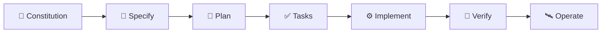

<div align="center">

# 🧮 QuantSmith

### *Build quant models the way you'd defend them — spec-driven, agentic, reproducible.*

QuantSmith is a **spec-driven, agentic SDK** for quant research and model development —
specialist agents, quality gates, standards, and persistent memory that keep every
signal and model **reproducible, leakage-safe, and traceable to a spec**.

<br/>

[](https://github.com/joshualutkemuller/QuantSmith/actions/workflows/ci.yml)
[](pyproject.toml)
[](instructions/spec_driven_development.md)
[](agents/README.md)
[](hooks/README.md)
[](specs/README.md)
[](.github/GIT_GUIDELINES.md)

<br/>

**[Quickstart](#-quickstart)** ·
**[Agents](#-public-agents)** ·
**[Runtimes & Specs](#-runtimes--specs)** ·
**[Workflows](docs/workflows.md)** ·
**[Adoption Guide](docs/adoption_guide.md)** ·
**[Docs](#-documentation)**

</div>

---

## 📖 Table of Contents

- [Why QuantSmith](#-why-quantsmith)
- [Spec-Driven Development](#-spec-driven-development)
- [Quickstart](#-quickstart)
- [Repository Shape](#-repository-shape)
- [Public Agents](#-public-agents)
- [Public Adapters](#-public-adapters)
- [Instructions & Standards](#-instructions--standards)
- [Prompt Library](#-prompt-library)
- [Quality Gates](#-quality-gates)
- [Runtimes & Specs](#-runtimes--specs)
- [Workflows](#-workflows)
- [Local Hook Setup](#-local-hook-setup)
- [Documentation](#-documentation)
- [Design Principles](#-design-principles)
- [Contributing](#-contributing)

---

## ✨ Why QuantSmith

> [!NOTE]
> QuantSmith is **intentionally practical**. It helps teams document assumptions,
> review data quality, reduce avoidable modeling mistakes, enforce lightweight
> workflow standards, and produce artifacts another researcher or engineer can pick
> up later.

| You want to… | QuantSmith gives you… |
| --- | --- |
| 🧠 Plan research from a hypothesis | Spec-driven planning agents + traceable requirements |
| 🔎 Catch leakage & time-alignment bugs | Point-in-time standards + `leakage`/`backtest` gates |
| 📝 Document features, models, backtests | Templates, cards, and reproducible run artifacts |
| 🤖 Reuse research workflows | 168 narrow, inspectable agent roles across the stack |
| 🚦 Stop mistakes before commit/push | 33 quality gates, advisory by default, CI-enforceable |
| 🗣️ Share a common vocabulary | An [agentic dictionary](agentic_dictionary.md) for the team |

---

## 🧭 Spec-Driven Development

The SDK follows a **Spec-Driven Development (SDD)** model with a strong engineering
focus: the specification is the source of truth, and every design decision, task,
test, and release traces back to it.



| Stage | Where it lives |
| --- | --- |
| 📜 **Constitution** | [`instructions/engineering_principles.md`](instructions/engineering_principles.md) — the non-negotiable rules every change is checked against |
| 🧭 **Method** | [`instructions/spec_driven_development.md`](instructions/spec_driven_development.md) — the flow, the ID scheme (`REQ`/`NFR`/`AC`/`T`/`RISK`), and traceability rules |
| 🗂️ **Artifacts** | each feature lives in `specs/NNNN-slug/` with `spec.md` (WHAT/WHY), `plan.md` (HOW), `tasks.md` (traceable work) — templates in [`templates/spec/`](templates/spec/), worked example in [`specs/0001-daily-momentum-signal/`](specs/0001-daily-momentum-signal/) |
| ⌨️ **Commands** | [`prompts/specify.md`](prompts/specify.md), [`prompts/plan.md`](prompts/plan.md), [`prompts/tasks.md`](prompts/tasks.md) |
| 🚦 **Gate** | [`hooks/stages/spec-check.sh`](hooks/stages/spec-check.sh) enforces the chain: no plan without a spec, no task without a requirement, no acceptance criterion without a test, no orphans |

Each SDLC stage owns one spec artifact, so the six stage agents and the hooks below
are the SDD flow made operational.

---

## 🚀 Quickstart

QuantSmith ships in **two layers** — a versioned Python package of runnable
runtimes, and a copyable scaffold of agents, gates, and standards. Use either or both.

<details open>
<summary><b>🐍 Layer 1 — install the package &amp; run a reference pipeline</b></summary>

<br/>

```sh
pip install quantsmith
```

```python
from quantsmith.pipelines import momentum_signal   # dependency-free, deterministic

# every runtime maps to a spec under specs/ and a test under tests/
```

The runtimes are stdlib-only and tested, so they run anywhere Python does. Browse
them in the [runtime catalog](src/quantsmith/pipelines/README.md).

</details>

<details>
<summary><b>🧰 Layer 2 — copy the scaffold &amp; wire the gates</b></summary>

<br/>

```sh
# from inside your quant repo, copy the SDK surfaces you want, then:
./setup-hooks.sh                        # wire local Git hooks
hooks/stages/run-stage.sh               # run all quality gates (advisory)
QF_STAGE_ENFORCE=1 hooks/stages/run-stage.sh spec   # blocking, as CI runs it
```

Full walkthrough — including per-project-type recipes — in the
[**Adoption Guide**](docs/adoption_guide.md).

</details>

> [!TIP]
> Not sure which layer fits? The [packaging decision record](docs/packaging.md)
> explains the hybrid model (versioned package **+** copyable template).

---

## 🗂️ Repository Shape

```text
quantsmith/
├── 📄 README.md
├── 📖 agentic_dictionary.md      # shared vocabulary
├── 🪝 setup-hooks.sh
├── 🤖 agents/                    # role contracts & catalog entries
├── 🔌 adapters/                  # provider boundaries (delivery, scheduling, data…)
├── 🐍 src/quantsmith/            # runnable runtime packages
├── 🚦 hooks/                     # local quality gates
├── 📐 instructions/              # reusable standards
├── 🧠 memory/                    # persistent workflow memory scaffold
├── ⌨️ prompts/                   # task-specific starting points
├── 🗂️ specs/                     # source-of-truth specifications
├── 🧾 templates/                 # repeatable artifacts (memos, cards, reports)
├── 🗃️ sources/                   # data source catalog (APIs, DBs, feeds)
├── 🧪 examples/
└── 📚 docs/
```

<details>
<summary>Current state notes</summary>

<br/>

- `.agents/` contains seed agent examples for general, Git, and design-oriented workflows.
- `.githooks/` contains seed Git hooks.
- `.github/` contains seed GitHub workflow and contribution templates.
- `agents/`, `adapters/`, `hooks/`, `instructions/`, `prompts/`, `templates/`, and `examples/` are the intended public SDK surfaces.
- `src/quantsmith/` contains executable runtime packages. Agent directories are role contracts and catalog entries, not long-term homes for Python modules.
- The old app-specific assets have been removed from the working tree; the remaining seed files now describe the SDK workflow.

</details>

---

## 🤖 Public Agents

> [!IMPORTANT]
> See [**`agents/README.md`**](agents/README.md) for the full catalog — the
> orchestrator, lifecycle, and domain agents mapped to stages, spec artifacts, and
> hooks. Every public agent follows the same four-file contract:
> `README.md` · `prompt.md` · `instructions.md` · `tasks.md`.

**🎛️ Orchestrator** — [`workflow_orchestrator/`](agents/workflow_orchestrator/) drives a
change through the spec-driven flow across all six stages, enforcing the gate between
each. Uses the catalog as its routing table.

<details>
<summary><b>🔄 Development-lifecycle agents</b> — one per SDLC stage</summary>

<br/>

- [`planning_requirements/`](agents/planning_requirements/): **Stage 1** — scopes requests into testable requirements, scope, and acceptance criteria.
- [`design_architecture/`](agents/design_architecture/): **Stage 2** — turns requirements into interfaces, data flow, validation strategy, and trade-offs.
- [`implementation/`](agents/implementation/): **Stage 3** — turns a design into reproducible, reviewable code and notebooks.
- [`testing_validation/`](agents/testing_validation/): **Stage 4** — maps acceptance criteria to tests and validates model/backtest results.
- [`deployment_release/`](agents/deployment_release/): **Stage 5** — production-readiness, rollout, rollback, and release handoff.
- [`maintenance_monitoring/`](agents/maintenance_monitoring/): **Stage 6** — monitoring, drift/decay triage, incidents, and doc upkeep.

</details>

<details>
<summary><b>🧪 Domain agents</b> — research, data quality, modeling, risk, release</summary>

<br/>

- [`research_analyst/`](agents/research_analyst/): turns hypotheses into research plans, assumptions, validation gates, and handoff-ready next actions.
- [`data_quality/`](agents/data_quality/): reviews datasets, joins, timestamps, lineage, missingness, and leakage risks.
- [`feature_engineering/`](agents/feature_engineering/): documents and reviews feature transforms for point-in-time safety, normalization leakage, and stability.
- [`modeling/`](agents/modeling/): model selection, leakage-free validation design, error analysis, and overfitting assessment.
- [`backtest_review/`](agents/backtest_review/): reviews historical simulations for bias, execution realism, robustness, risk, and production-readiness.
- [`risk/`](agents/risk/): factor exposure, concentration, drawdown, tail/stress risk, and monitorable risk limits.
- [`portfolio_management/`](agents/portfolio_management/): manages the full PM lifecycle from mandate and universe through signal intake, allocation, construction oversight, implementation, risk, compliance, attribution, liquidity, tax, monitoring, and governance.
- [`git_release/`](agents/git_release/): keeps commits, PRs, changelogs, and release records clean and traceable to the spec.

</details>

<details>
<summary><b>📥 Data ingestion &amp; 🔐 secrets management</b></summary>

<br/>

**Ingestion** (`agents/data_ingestion/`) — `database_connectivity/`, `file_ingestion/`, `api_ingestion/`: bring external data in from SQL/warehouses, files (CSV, Parquet, Excel, JSON, XML, …), and APIs as typed, validated, reproducible datasets with a data contract.

**Secrets management** (`agents/secrets_management/`) — `secret_storage/`, `credential_access/`, `secret_rotation/`, `secret_scanning/`: store, read, write/rotate, and scan for secret keys, credentials, and custom key/values — enforcing that secrets never enter the repo (constitution P9).

</details>

<details>
<summary><b>🏗️ Data engineering &amp; 📊 analytics</b></summary>

<br/>

**Data engineering** (`agents/data_engineering/`):
- `pipeline_orchestration/`: designs and runs data pipelines as DAGs — dependency ordering, per-step data contracts, idempotent partitioned runs, retries, backfill, and a run manifest (spec `0011`, tested runtime).
- `pipeline_observability/`: reads the run manifest for freshness, data-downtime, SLA, and lineage (spec `0019`, tested runtime).
- `data_modeling/`, `pipeline_builder/`, `pipeline_deployment/`, `data_governance/`: design-and-review roles for dimensional modeling, DAG compilation, environment promotion/rollback, and catalog/lineage/access policy.

**Analytics** (`agents/analytics/`):
- `metrics_semantic_layer/`: the canonical metrics layer — one source-of-truth definition per KPI, computed consistently and point-in-time, with governance and dimension reconciliation.
- `experimentation/`: disciplined A/B test design and readout — power/sample-size, sample-ratio-mismatch validity, p-value/CI consistency, and a power-gated verdict.
- `data_storytelling/`: turns a governed `Report` into an audience-tailored narrative (situation → insight → action), evidence-bounded and provenance-carrying.
- `dashboard_design/`: produces a tool-agnostic dashboard spec (hierarchy, chart selection, drill paths, accessibility) that the tool-specific dashboard agents render.

</details>

<details>
<summary><b>🛰️ Monitoring &amp; 🚨 alerting</b></summary>

<br/>

**Monitoring** (`agents/monitoring/`) — `pipeline_monitoring/`, `model_signal_monitoring/`, `infrastructure_cost_monitoring/`: watch pipelines, live signals/models, and infra/cost against point-in-time baselines, report honest health (degraded on any breach), and emit `Observation`s for the alerting layer instead of paging directly (spec `0021`, tested `signal_monitoring` runtime).

**Alerting** (`agents/alerts/`) — `alert_policy/`, `alert_router/`, `incident_notification/`: turn monitoring observations into deduplicated, severity-routed alerts — policy evaluation, suppression, escalation, owner/channel routing, and redaction — delivering through the `adapters/alert_delivery/` contract, all seven providers now executable (email, webhook, Slack, Teams, ticketing, PagerDuty/Opsgenie, SMS/push — specs `0032`/`0037`), never remediating silently (spec `0020`, tested `alerting` runtime).

</details>

<details>
<summary><b>🛠️ Tooling, 📚 knowledge, 📈 trading strategies, 🌍 asset classes, 💵 financing &amp; 🧮 formulaic alphas</b></summary>

<br/>

**Tooling** (`agents/tooling/`) — `excel/`, `power_bi/`, `tableau/`, `react/`, `streamlit_dash/`, `looker/`, `qlik/`, `superset/`: reproducibility, point-in-time correctness, auditability, and secrets-safe connections to the spreadsheet, BI, and web-dashboard tools quants use. All but `tableau` render the shared dashboard spec (specs `0015`/`0016`/`0018`) — one governed design, seven targets.

**Knowledge** (`agents/knowledge/`) — `knowledge_ingestion/`, `knowledge_curation/`, `knowledge_retrieval/`, `institutional_memory/`: absorb, organize, retrieve, and persist institutional knowledge across domains — grounded, cited answers, access control and information barriers, provenance, and durable memory. Spec `0056` extends this into a market-research knowledge base: the same MCP retrieval surface, with separate governed storage and entitlement-aware access for user notes, firm research, tagged email market color, and approved external-manager materials.

**Role operations** (`agents/role_operations/`) — `meeting_to_action/`, `status_rollup/`, `rapid_scaffolder/`, `prior_art_scanner/`, `demo_narrative_packager/`, `tough_question_rehearsal/`, `experiment_ledger/`, `model_card_drafter/`, `audit_trail_keeper/`, `governance_readiness_checklist/`, `second_look_backtest_reviewer/`, `build_handoff_writer/`, `alert_triage/`: absorb a quant/data-science lead's operational overhead — meeting follow-ups, status updates, prototype setup, first-pass research scans, demo prep, and governance-adjacent drafting — so more time goes to model scoping and research. Configurable via a local, **gitignored** `role_context.yml`; this repository never carries real platform, client, or personal data, enforced by the `role-context` gate. All three phases of the four-pillar roster are shipped (specs `0024`, `0029`, `0030`) — fourteen agents in total; `second_look_backtest_reviewer` and `alert_triage` hand off to `backtest_review` and `alert_router`/`incident_notification` rather than replacing them.

**Trading strategies** (`agents/trading_strategies/`) — `momentum_trend/`, `mean_reversion_statarb/`, `carry/`, `value_factor/`, `volatility_options/`, `event_driven_arbitrage/`, `macro_multi_asset/`, `market_making_microstructure/`: design-and-review roles for the archetypes in *151 Trading Strategies* (Kakushadze & Serur).

**Asset class mechanics** (`agents/asset_classes/`) — `equities/`, `fixed_income_rates/`, `fx/`, `commodities/`, `digital_assets/`: mechanics-only agents, one per asset class, covering settlement, sessions, conventions, corporate actions/roll, curve construction, and custody — handing `trading_strategies/` and `securities_financing/` clean, point-in-time-correct inputs instead of duplicating mechanics per archetype (spec `0022`).

**Securities financing** (`agents/securities_financing/`) — `securities_lending/`, `repo_financing/`, `collateral_management/`, `financing_cost_analysis/`: make financing a first-class part of strategy economics — borrow cost, short rebate, repo/funding, collateral and margin. `securities_lending/` has a tested runtime — GC/WARM/HTB classification, LP inventory optimization, concentration risk (spec `0023`). `financing_cost_analysis/` also has one — cost-of-carry decomposition, financing-aware returns, rate-shock sensitivity, capacity (spec `0028`); `repo_financing/` and `collateral_management/` remain agent-contract-only.

**Economists** (`agents/economists/`) — `macro_indicator_analyst/`, `monetary_policy_analyst/`, `macro_regime_classifier/`, `cross_asset_macro_linkages/`, `macro_scenario_analyst/`, `macro_backdrop_summarizer/`, `economic_outlook_report_writer/`: give a quant or portfolio-management workflow a grounded macro backdrop — indicators through policy through a classified regime through cross-asset/scenario translation to a recurring brief and a periodic outlook report. Analysis and synthesis only; strategy design stays `trading_strategies/macro_multi_asset`'s job and live-model regime-change detection stays `monitoring/model_signal_monitoring`'s job. Draws on `sources/{fred,bls,bea,census,eia}.yml`; every figure traces to a supplied input or registered source, never invented (spec `0033`).

**Formulaic alphas** (`agents/formulaic_alphas/`) — `alpha_construction/`, `alpha_combination/`, `alpha_evaluation/`: operationalize the methodology of *101 Formulaic Alphas* (Kakushadze, 2016) — build tradable signals from an operator library, combine weakly-correlated alphas, and evaluate holding period, turnover, correlation, and capacity.

**Test engineering** (`agents/test_engineering/`) — `test_engineering_orchestrator/`, `python_test_engineer/`, `cpp_test_fuzz_engineer/`, `javascript_test_engineer/`, `typescript_test_engineer/`: language-specific test authoring — pytest, GoogleTest/Catch2 plus libFuzzer/AFL++ fuzzing (authorized targets only), Jest/Vitest/Mocha, and TypeScript type-level tests, with an orchestrator that routes by detected stack. Writes and reviews the tests and fuzz harnesses only; `testing_validation` decides whether they close an acceptance criterion and `quality-guard-agent` decides whether a stage may release (spec `0062`).

</details>

---

## 🔌 Public Adapters

> [!NOTE]
> **Agents decide what happened and what should be done. Adapters translate approved
> payloads into provider-specific actions** — sending email, posting to Slack/Teams,
> scheduling a GitHub Actions workflow, writing an artifact, querying a warehouse, or
> invoking an approved model runtime.

See [`adapters/README.md`](adapters/README.md) for the catalog: alert delivery,
schedulers, artifact delivery, data access, LLM runtimes, and model plugins
(registering an already-built internal optimization model, spec `0026`) — the
provider boundary for workflows and agents.

---

## 📐 Instructions & Standards

Reusable standards and behavioral rules that agents follow.

<table>
<tr><td>

**Foundations**
- [`engineering_principles.md`](instructions/engineering_principles.md) — the constitution
- [`spec_driven_development.md`](instructions/spec_driven_development.md) — the SDD method
- [`point_in_time.md`](instructions/point_in_time.md) — leakage checklist
- [`reproducibility.md`](instructions/reproducibility.md) — P4 operationalized; backs the `repro` gate
- [`workflow_memory.md`](instructions/workflow_memory.md)
- [`git_workflow.md`](instructions/git_workflow.md)
- [`documentation.md`](instructions/documentation.md)

</td><td>

**Quant & research**
- [`quant_research.md`](instructions/quant_research.md)
- [`data_quality.md`](instructions/data_quality.md)
- [`risk_management.md`](instructions/risk_management.md)
- [`backtesting.md`](instructions/backtesting.md)
- [`model_development.md`](instructions/model_development.md) — how to build
- [`model_validation.md`](instructions/model_validation.md) — how to validate
- [`trading_strategies.md`](instructions/trading_strategies.md)
- [`portfolio_management.md`](instructions/portfolio_management.md)
- [`asset_class_mechanics.md`](instructions/asset_class_mechanics.md)
- [`securities_financing.md`](instructions/securities_financing.md)
- [`macro_economic_analysis.md`](instructions/macro_economic_analysis.md)
- [`formulaic_alphas.md`](instructions/formulaic_alphas.md)
- [`optimization.md`](instructions/optimization.md)
- [`model_plugin_integration.md`](instructions/model_plugin_integration.md)
- [`machine_learning.md`](instructions/machine_learning.md)
- [`deep_learning.md`](instructions/deep_learning.md)

</td><td>

**Data & operations**
- [`metrics_semantic_layer.md`](instructions/metrics_semantic_layer.md)
- [`data_storytelling.md`](instructions/data_storytelling.md)
- [`pipeline_engineering.md`](instructions/pipeline_engineering.md)
- [`data_ingestion.md`](instructions/data_ingestion.md)
- [`monitoring.md`](instructions/monitoring.md)
- [`alerting.md`](instructions/alerting.md)
- [`knowledge_base.md`](instructions/knowledge_base.md)
- [`role_operations.md`](instructions/role_operations.md)
- [`data_provenance.md`](instructions/data_provenance.md)
- [`data_source_catalog.md`](instructions/data_source_catalog.md)
- [`test_engineering.md`](instructions/test_engineering.md)

</td></tr>
</table>

---

## ⌨️ Prompt Library

<details>
<summary><b>Spec-driven commands &amp; artifact prompts</b></summary>

<br/>

**Spec-driven commands**
- [`prompts/specify.md`](prompts/specify.md) — author `spec.md`
- [`prompts/plan.md`](prompts/plan.md) — author `plan.md`
- [`prompts/tasks.md`](prompts/tasks.md) — author `tasks.md`

**Artifact prompts**
- [`prompts/research_plan.md`](prompts/research_plan.md)
- [`prompts/dataset_card.md`](prompts/dataset_card.md)
- [`prompts/data_contract.md`](prompts/data_contract.md)
- [`prompts/model_card.md`](prompts/model_card.md)
- [`prompts/backtest_review.md`](prompts/backtest_review.md)
- [`prompts/experiment_summary.md`](prompts/experiment_summary.md)
- [`prompts/run_card.md`](prompts/run_card.md)
- [`prompts/model_monitoring.md`](prompts/model_monitoring.md)
- [`prompts/postmortem.md`](prompts/postmortem.md)
- [`prompts/handoff_memo.md`](prompts/handoff_memo.md)
- [`prompts/pr_review_checklist.md`](prompts/pr_review_checklist.md)

</details>

---

## 🚦 Quality Gates

`hooks/stages/` adds quality gates that pair with the SDLC stages and quant concerns.
They are **advisory by default** (print findings, exit `0`) and degrade gracefully
when tools or files are missing — set `QF_STAGE_ENFORCE=1` to make them blocking.

```sh
hooks/stages/run-stage.sh                 # run all gates (advisory)
hooks/stages/run-stage.sh testing         # run a single stage
QF_STAGE_ENFORCE=1 hooks/stages/run-stage.sh spec   # blocking (as CI runs it)
```

| Category | Gates |
| --- | --- |
| 🧭 Cross-cutting | `spec` |
| 🔄 Per-stage | `planning` · `design` · `implementation` · `testing` · `deployment` · `maintenance` |
| 📈 Quant | `leakage` · `backtest` · `repro` · `data-contract` · `pipeline-contract` · `alert-contract` · `monitoring-coverage` · `data-provenance` |
| 🗃️ Repo | `secret-scan` · `docs-link` · `agent-catalog` · `spec-index` · `readme-sync` · `doc-counts` · `quantsmith-version` · `agent-attribution` · `handoff-sync` · `upstream-drift` · `ownership` · `persistent-knowledge` · `knowledge` · `role-context` · `model-plugin` · `source-catalog` |

> [!TIP]
> Use `QF_RUN_TESTS=1` to let the testing stage run the suite, and
> `QF_DIFF_BASE=<ref>` to diff against a base branch. See
> [`hooks/README.md`](hooks/README.md) for wiring into Git and CI.

---

## 🧪 Runtimes & Specs

Runnable, **dependency-free** reference pipelines (with tests) that make the specs
executable. Full map in the [runtime catalog](src/quantsmith/pipelines/README.md) and
the [spec index](specs/README.md).

| Spec | Feature | Runtime |
| --- | --- | --- |
| [`0001`](specs/0001-daily-momentum-signal/) | Daily cross-sectional momentum signal *(reference)* | `momentum_signal.py` |
| [`0006`](specs/0006-ml-return-forecasting/) | Cross-sectional short-horizon return forecasting | `return_forecasting.py` |
| [`0041`](specs/0041-ranking-forecast/) | Cross-sectional ranking forecast — a pairwise (RankNet-style) ranking-loss variant of `0006`, composing its labels/features/folds/evaluation unmodified | `ranking_forecast.py` |
| [`0048`](specs/0048-workflow-memory-runtime/) | Workflow memory runtime — makes `0002`'s committed store machine-readable: typed records, a type-aware point-in-time filter (mechanical facts timeless, claims about what worked bounded by `last_confirmed`), and structural validation replacing the string grep | `workflow_memory.py` |
| [`0049`](specs/0049-workflow-memory-write-path/) | Workflow memory write path — propose/stage candidates to a committed `memory/inbox/`, promote/discard as deliberate human actions, author resolution finishing `0048`'s outstanding requirement, one worked producer integration from `0039`'s real validation findings | `workflow_memory.py` *(extended)*, `workflow_memory_cli.py` |
| [`0057`](specs/0057-knowledge-console/) | Knowledge Console — read-only analytics web app over the `memory/` store built on `0048`: view-model (counts, trends, knowledge graph, changes feed, needed-review queue), a stdlib HTTP API, a pluggable natural-language query seam (grounded keyword now, LLM later), and a Vite/React front end with a self-contained snapshot | `knowledge_console/` |
| [`0058`](specs/0058-viewer-access-control/) | Viewer access control — activates `0048`'s deferred `access_level` field: an opt-in, committed `access/roster.yml` maps a resolved pseudonymous handle to a `public`/`internal`/`restricted` clearance, enforced once at the read boundary in `query()` and both `0057` view-model builders | `access_control.py` |
| [`0056`](specs/0056-market-research-knowledge-base/) | Market research knowledge base — user notes, firm research, generated summaries, and approved sell-side/manager materials, with governed point-in-time retrieval, entitlement-aware access, citations, audit ledger, and conflict curation (Slices 1/3/4 unblocked; email connector and MCP surface pending) | `market_research.py` |
| [`0059`](specs/0059-morning-market-brief/) | Morning market brief — free-API commentary (NewsAPI/Alpha Vantage/Finnhub) → deterministic headlines + sentiment rollup → agent-written analysis → staged `pending_review` candidate, never committed | `market_brief.py` |
| [`0061`](specs/0061-quant-model-factory/) | Quant Model Factory — parallel model-development lanes with `best_of_n` / `all_required` / `first_to_pass` convergence; caller-injected executor; `ConvergenceGate` scoring (Sharpe, drawdown, return); append-only JSONL ledger for full auditability | `quant_factory.py` |
| [`0055`](specs/0055-workflow-scheduling-operations/) | Workflow scheduling operations — registry validation, cron dry-run evidence, idempotent dispatch, JSONL ledger, manual reminders, daily reports, alert handoff, memory candidates | `workflow_scheduling.py` |
| [`0047`](specs/0047-downstream-contract/) | Downstream consumer contract — `DashboardSpec.schema_version` + compatibility check, release-notify workflow, and a copyable `quantsmith-version` gate for a separate consuming repository | `dashboard_spec.py` *(extended)* |
| [`0046`](specs/0046-walk-forward/) | Walk-forward harness — purged/embargoed folds from `0006` refit per fold through `0044`'s engine; reports the out-of-sample fold distribution | `walk_forward.py` |
| [`0045`](specs/0045-fred-point-in-time/) | FRED point-in-time panel adapter — vintage-correct reads of `gold_fred_point_in_time`, so a later revision cannot leak backwards | `fred_point_in_time.py` |
| [`0044`](specs/0044-backtesting/) | Backtest engine — net-of-cost simulation, no look-ahead by construction, probabilistic Sharpe on every run | `backtesting.py` |
| [`0042`](specs/0042-pipeline-builder/) | Pipeline builder — compiles a declared intent into a DAG validated by `0011`'s own toposort, reviews readiness, renders a `pipeline_manifest.md` | `pipeline_builder.py` |
| [`0007`](specs/0007-portfolio-construction/) | Constrained portfolio construction (QP) | `portfolio_construction.py` |
| [`0008`](specs/0008-metrics-semantic-layer/) | Metrics semantic layer | `metrics_semantic_layer.py` |
| [`0009`](specs/0009-experimentation/) | Experiment (A/B test) analysis | `experimentation.py` |
| [`0010`](specs/0010-analytics-pipeline/) | End-to-end analytics pipeline | `analytics_pipeline.py` |
| [`0011`](specs/0011-data-pipeline-orchestration/) | Data-pipeline orchestration (DAG runner) | `data_pipeline.py` |
| [`0012`](specs/0012-execution-scheduling/) | Optimal execution scheduling (Almgren-Chriss) | `execution_optimization.py` |
| [`0013`](specs/0013-optimization-solvers/) | Optimization solvers (LP/MILP/flow/DP) | `optimization_solvers.py` |
| [`0015`](specs/0015-powerbi-dashboard-profile/)/[`0016`](specs/0016-excel-react-dashboard-profiles/)/[`0018`](specs/0018-remaining-dashboard-profiles/) | Dashboard profiles — 7 targets from one shared spec | `*_profile.py`, `bi_profiles.py` |
| [`0017`](specs/0017-dashboard-render-adapters/) | Executable render adapters — React scaffold + `.xlsx` writer | `adapters/dashboard_render/` |
| [`0019`](specs/0019-pipeline-observability/) | Pipeline observability — freshness, downtime, SLA, lineage | `pipeline_observability.py` |
| [`0020`](specs/0020-alerting/) | Alerting — policy evaluation + routing | `alerting.py` |
| [`0021`](specs/0021-signal-monitoring/) | Model/signal monitoring — drift, calibration, decay, regime | `signal_monitoring.py` |
| [`0023`](specs/0023-securities-lending-workflow/) | Securities lending — borrow classification, LP inventory optimization, concentration risk | `quant/agentic_quant/sec_lending_workflow.py` *(not `pipelines/`; needs `numpy`)* |
| [`0028`](specs/0028-financing-cost-analysis/) | Financing cost analysis — cost-of-carry decomposition, financing-aware returns, rate-shock sensitivity, capacity | `financing_cost_analysis.py` |
| [`0032`](specs/0032-alert-delivery-providers/) | Alert delivery executable providers — email + webhook, deterministic payload/redaction, injectable transport | `adapters/alert_delivery/` |
| [`0037`](specs/0037-alert-delivery-remaining-providers/) | Alert delivery — Slack, Teams, ticketing, PagerDuty/Opsgenie, SMS/push; completes all seven providers, with structural severity gating + SMS length cap | `adapters/alert_delivery/` |
| [`0052`](specs/0052-mcp-adapter-contract/) | MCP adapter contract + knowledge resources server — stdlib-only JSON-RPC 2.0 adapter for the MCP `resources` primitive; `caller_clearance` required on every request (never assumed from connection identity); `knowledge://` URI scheme for `sources`/`memory`/`market_research` authorities; credential scan + path-traversal protection; unblocks 0053, 0054, and 0056 T-003 | `adapters/mcp_servers/` |
| [`0034`](specs/0034-cardinality-constrained-portfolio/) | Cardinality-constrained portfolio construction — MILP selects, QP sizes (a documented two-stage heuristic on `0013` + `0007`) | `cardinality_portfolio.py` |
| [`0035`](specs/0035-funding-ladder/) | Funding ladder — matches cash obligations to funding tenors at minimum cost via `0013`'s min-cost flow; general treasury/cash, not securities-financing | `funding_ladder.py` |
| [`0036`](specs/0036-multi-period-rebalancing/) | Multi-period rebalancing — a discretized single-position DP via `0013`'s `solve_dp`, trading transaction cost against tracking-error cost over a horizon | `multi_period_rebalancing.py` |
| [`0038`](specs/0038-factor-risk-model/) | Factor risk model — variance decomposition, Euler risk attribution, concentration, linear stress loss; operationalizes `instructions/risk_management.md` | `factor_risk_model.py` |
| [`0039`](specs/0039-ingestion-data-contract/) | Ingestion data contract emission — validates a pulled row set against a declared schema/key/quality-rule contract, renders a `data_contract.md` populated with real computed results | `ingestion_data_contract.py` |

**Themed chains**

- 🔬 **Quant research:** `0001` signal → `0006` forecast (`0041` ranking-loss variant) → `0007` portfolio → `0012` execution → `0038` factor risk → `0044` backtest → `0046` walk-forward
- 📌 **Portfolio management:** mandate → universe → signal intake → allocation policy → construction oversight → implementation → monitored governance
- 🧮 **Optimization toolkit:** `0007` (QP) · `0013` (LP/MILP/flow/DP) · `0012` (control) · `0034` (cardinality-constrained portfolio, composing `0013`+`0007`) · `0035` (funding ladder, `0013`'s min-cost flow) · `0036` (multi-period rebalancing, `0013`'s DP) — every `0013` solver now has a shipped application
- 📊 **Data Analyst:** `0008` metrics → `0009` experimentation → `0010` pipeline → `0014` storytelling → `0015`/`0016`/`0018` dashboards → `0017` render adapters
- 🏗️ **Data Engineer:** `0042` pipeline builder (design-time) → `0011` orchestration (execution) → `0019` observability
- 🛰️ **Monitoring & alerting:** `0021` signal monitoring → `0020` alerting → `adapters/alert_delivery/` (`0032`: email + webhook; `0037`: Slack, Teams, ticketing, PagerDuty/Opsgenie, SMS/push — all seven executable)
- 💵 **Securities financing:** `0022` asset-class mechanics → `0023` securities lending → `0028` financing cost analysis → backtest/risk
- 🌐 **Macro & economics:** `0027` source catalog → `0033` economists agents (indicators → policy → regime → cross-asset/scenario → brief/outlook) → `macro_multi_asset`, `portfolio_management`, `risk`
- 🗂️ **Data foundations:** `0027` source catalog → `data_contract.md` (per-dataset) → `agents/data_ingestion/` → `0039` ingestion data contract emission (validates real rows, renders a populated contract) → `data_quality`/`point_in_time`

---

## 🗺️ Workflows

See [**`docs/workflows.md`**](docs/workflows.md) for the workflow map — the Quant
Researcher, Quant Model Build, Data Analyst, Data Engineer, and Analytics Pipeline
workflows as ordered agent + gate chains, all on the Spec-Driven Development backbone.

---

## 🪝 Local Hook Setup

From inside `quantsmith`, run:

```sh
./setup-hooks.sh
```

> [!WARNING]
> The current Git hooks are **seed examples** and should be updated before relying on
> them for production quant workflows. In particular, the current pre-commit and
> pre-push hooks still assume an older app layout.

---

## 📚 Documentation

| Doc | What's inside |
| --- | --- |
| [`specs/README.md`](specs/README.md) | The spec index — every spec with its runtime and tests |
| [`src/quantsmith/pipelines/README.md`](src/quantsmith/pipelines/README.md) | The runtime catalog — every reference pipeline mapped to its spec and tests |
| [`sources/README.md`](sources/README.md) | The data source catalog — every API/DB/feed with quality, point-in-time, and credential-pointer metadata |
| [`docs/workflows.md`](docs/workflows.md) | The workflow map — role and scenario workflows as agent + gate chains |
| [`docs/adoption_guide.md`](docs/adoption_guide.md) | How to adopt the SDK — package + scaffold — into an existing quant repo |
| [`docs/packaging.md`](docs/packaging.md) | Packaging & distribution decision record (hybrid: package + template) |
| [`docs/sdk_plan.md`](docs/sdk_plan.md) | Roadmap and proposed SDK architecture |
| [`docs/handoff.md`](docs/handoff.md) | Continuation guide for the next implementer |
| [`CHANGELOG.md`](CHANGELOG.md) | Release history and the versioning policy |
| [`agentic_dictionary.md`](agentic_dictionary.md) | Definitions for the SDK vocabulary |

---

## 🎯 Design Principles

> - **Make expert review easier, not optional.**
> - Keep agent roles narrow and inspectable.
> - Surface assumptions, limitations, data lineage, and validation choices.
> - Treat leakage, time alignment, survivorship bias, overfitting, and transaction costs as **first-class review concerns**.
> - Prefer reproducible artifacts over conversational memory.
> - Let exploratory work stay fast while making handoff work rigorous.

---

## 🤝 Contributing

Contributions follow the spec-driven flow and the house conventions:

- 📜 Read the [engineering principles](instructions/engineering_principles.md) (the constitution) and the [SDD method](instructions/spec_driven_development.md).
- 🌿 Work on a feature branch; **never push to `main` directly**. See [`.github/GIT_GUIDELINES.md`](.github/GIT_GUIDELINES.md) and [`instructions/git_workflow.md`](instructions/git_workflow.md).
- ✍️ Use **Conventional Commits** (`type(scope): description`) — enforced by the `commit-msg` hook. Run `./setup-hooks.sh` once to wire local Git hooks.
- 🚦 Run the gates before finishing: `hooks/stages/run-stage.sh` (advisory) or `QF_STAGE_ENFORCE=1 hooks/stages/run-stage.sh spec` (blocking, as CI runs it).
- 🤖 A public agent is any directory with `prompt.md` plus the four-file contract and a `Spec-Driven Role`; add a row to [`agents/README.md`](agents/README.md).

<div align="center">

<br/>

**Build quant models the way you'd defend them.**

*Spec-driven · agentic · reproducible*

</div>
